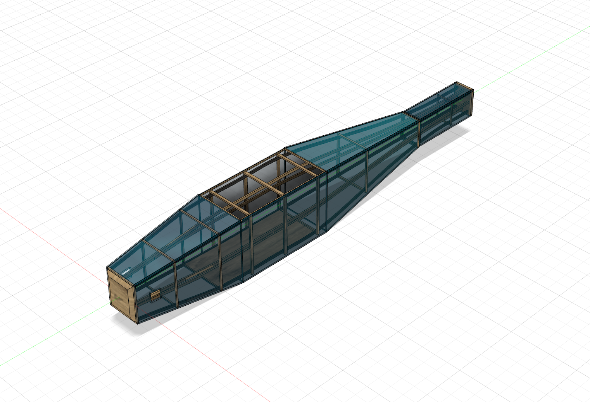
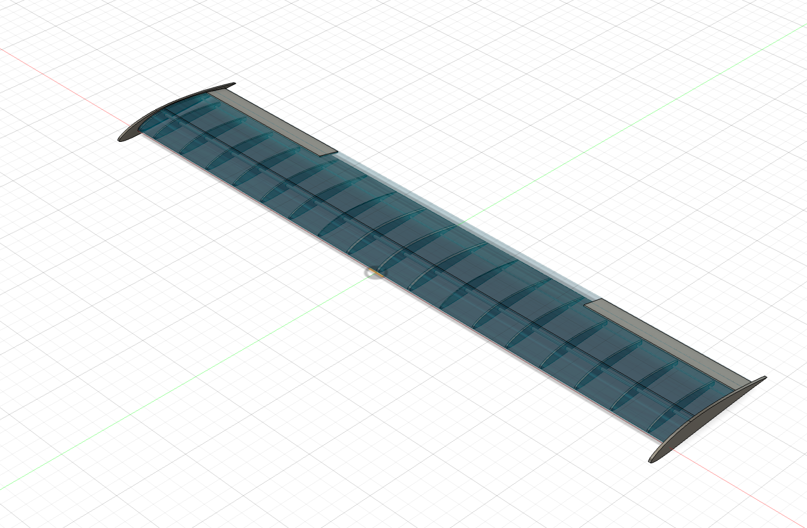
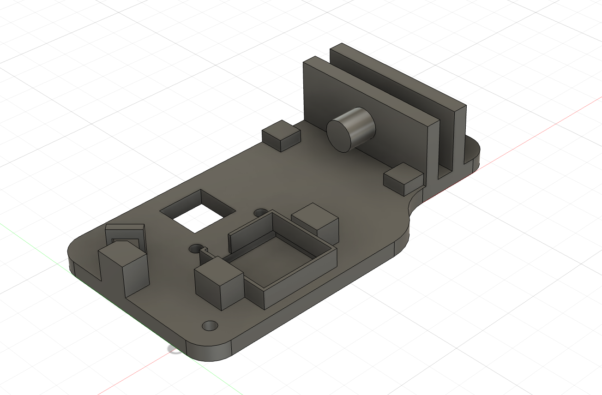
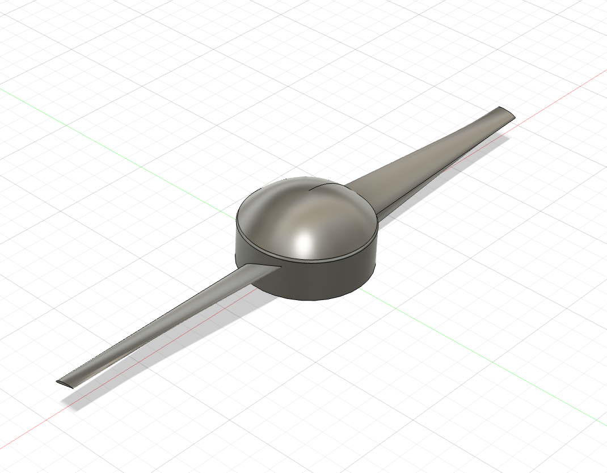

# rc-aircraft-design-project
This repository contains my contributions to an aeromodelling project, focusing on aircraft wing and fuselage design and structural layout.

## My Contributions
- Designed fuselage design and internal structure
- Worked on wing design and structural layout
- Helped model the payload mechanism design
- Modelled propeller using twist angles decided on by team

---

## Fuselage

### Isometric View

---

## Wing

### Isometric View

---

## Payload Mechanism

### Isometric View

---

## Propeller

### Isometric View

